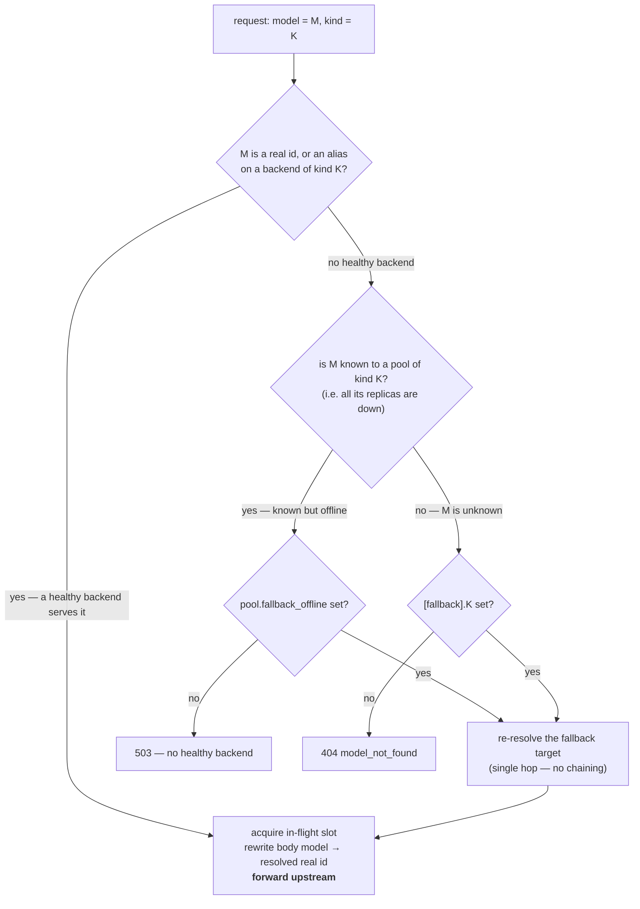

# Upstreams (multi-provider routing + load balancing)

The gateway routes each request to one of several upstream LLM backends based on the requested model name. **Routes are not declared statically** — the health probe parses each backend's `/models` response and the registry routes by what each upstream reports it serves. Load a model on a backend in the right kind of pool and it becomes routable automatically.

## Core abstraction

```text
request.model ──► [walk pools matching kind] ──► [pool whose backends advertise model]
              ──► [pool picker among healthy backends that have the model] ──► HTTP upstream
```

- A **`Backend`** is a single addressable upstream: base URL, optional API key, weight, `max_inflight`, plus a runtime-populated set of advertised model IDs.
- A **`Pool`** is an ordered set of backends sharing a `kind` (`chat` | `transcription` | `embedding` | `image` | `speech` | `ocr`) and a picker strategy. Pools own:
    - A health-check loop per backend.
    - A picker strategy (`prefix_affinity`, `least_inflight`, `round_robin`). Default: `least_inflight`; prefer `prefix_affinity` for chat pools with several self-hosted replicas — see [Picking strategies](#picking-strategies).
    - Implicit "what we serve" — the union of all backends' advertised-model sets.

`crates/gateway-core/src/server/upstreams/` owns the runtime: the topology is loaded from the database (edited in the UI at `/admin/upstreams`), `registry.rs` walks pools per request, and `health.rs` runs the probe loop.

## Configuring pools & backends

Pools, backends, and per-model settings are configured **in the admin UI at `/admin/upstreams`** — the only supported path; there is no config-file topology. This section describes the fields you set there and how they behave; the [operator workflow](#operator-workflow) below has the click-path.

A **pool** has a name, a `kind` (`chat` | `transcription` | `embedding` | `image` | `speech` | `ocr`), a picker `strategy` (`prefix_affinity` — recommended for multi-replica chat pools — `least_inflight`, or `round_robin`), optional GDPR/NDA compliance flags, a rate-limit-exemption toggle, and an optional offline-fallback model. An `ocr` pool is reserved for internal document parsing and is not a general-purpose chat endpoint.

A **backend** belongs to one pool and carries a name, base URL, an API key (entered once, stored encrypted; an env-var name can be given as a fallback), weight, max in-flight, health path, client-facing aliases, and two capability flags:

- **Discover models from probe** (`probe_models`, default on). When off, the health probe is a pure liveness check and never overwrites the backend's configured model list. Turn it off for image/speech backends whose `/models` returns a *chat* catalog (z.AI's general endpoint, OpenAI) — otherwise the probe replaces the real model ids, makes them unroutable, and pollutes `/v1/models`. Such backends instead get an explicit model list (on the backend, or on the pool).
- **Supports image editing** (`supports_edit`, default off). Marks an image backend as capable of editing. The `edit_image` tool is only registered when some image backend sets this, and editing is additionally refused against a backend whose pool is non-GDPR (it would ship existing user images off-site).

A **speech** pool also takes an optional voice map — one voice id per spoken language (lowercase ISO-639-1), plus a default used when no language matches; voice mode resolves the voice from the language the STT detected. Unlike other kinds, a speech pool has **no unknown-model fallback** — a mistyped model or voice just surfaces the backend's own error. The chat UI's voice mode appears only when both a speech pool and a transcription model exist (see [`ui.md`](ui.md)).

Beside the map, a speech pool takes a list of **selectable voices** (`offer_voices`; one id per line in the admin form, order preserved). That is a different question from the map's: the map answers "which voice for German" and holds exactly one voice per language, while the list is the menu the chat header's per-user voice picker shows — three German voices are expressible in the list and not in the map. Leave it empty and the picker falls back to offering whatever the map resolves to, which in a single-voice deployment is one entry and hides the picker. A user's stored pick wins over the map on every synthesis, but only while it is still on the list (or in the map): drop a voice from the config and everyone who had picked it silently returns to the default rather than sending the provider an id it doesn't know.

An **ocr** pool is used internally for document parsing and is not exposed through
the public chat model list. Its backend is an internal document-aware OCR
sidecar, not the raw vLLM OpenAI endpoint. The sidecar may use the official
`infer.py --pdf` wrapper; it owns PDF rasterization and sends the model's
required image requests and `vllm_xargs` values itself.

There is no static model table: each backend's `/models` response is the source of truth for what it serves. API keys are stored encrypted at rest; the optional env-var fallback is the only place key material comes from the environment.

For aliases and the two fallback mechanisms, see [Model aliases](#model-aliases) and [Fallback models](#fallback-models) below.

## Model discovery

Every 5 s, each backend gets a `GET <base_url>/models` probe (with the backend's bearer token, if configured). On 200 + parseable OpenAI envelope (`{"data": [{"id": ...}, ...]}`), the backend's advertised-model set is **replaced wholesale** with the names in `data[].id`. On 401 or non-parseable 200, the backend is marked alive but its model set is left as-is (so a previously-populated set survives a transient parser failure). On network error, timeout, or 5xx, the probe counts toward the unhealthy threshold.

At startup, `health::spawn` runs an initial parallel probe round and awaits it before returning, so the first request lands on a registry that already knows what each backend serves. Worst case (every backend unreachable): the gateway waits the 2 s probe timeout and starts serving with empty model sets, returning `400 invalid_request` until the looping probe populates them.

### Routing rules

When a request arrives with `model = "X"` and the handler asks for `PoolKind::Chat`:

1. Walk pools where `pool.kind == Chat`.
2. Find the first one with at least one **healthy** backend whose advertised set contains `"X"`.
3. From that pool, the picker strategy orders the candidate set; the first non-saturated backend gets an inflight slot.

If two pools of the same kind advertise the same model, the first one we iterate wins. `HashMap` iteration order isn't deterministic, so production deployments shouldn't rely on a tie-breaker — keep one pool per kind in practice.

## Model aliases

An **alias** is a stable, client-facing name that routes to a real model, decoupling *what clients ask for* from *which model is actually loaded*. The problem it solves: without aliases a client hardcodes `Qwen/Qwen2.5-72B-Instruct`; the day you load `Qwen/Qwen3-235B` instead, the old id vanishes and every connected client `404`s until it's reconfigured. Point clients at the alias `qwen`, swap the loaded model, keep the alias — and nothing downstream changes.

Aliases are set **per backend**, in the Add/Edit backend form's **Aliases** field (one `name=target` per line). The same alias on several backends forms a **routing group**: a request for the alias load-balances across all of them via the normal pool picker, exactly as if they all advertised one shared model id. Both the alias *and* the real id are routable, and both appear in `/v1/models` — asking for the real id still pins that exact model.

There are two forms, and you pick **one per backend**:

- **Bare name** (the GPU norm) — a name with no target (leave the `=target` off, e.g. just `qwen`). It binds to the one model that backend serves, so it needs no target.
- **`name=target`** — required on a **multi-model** backend (e.g. a cloud provider serving many models behind one base URL), where a bare name couldn't tell which model it means. For example `smart=glm-4.6` and `cheap=glm-4.5-air` on two lines.

Both forms combine freely *across* backends into one group — a bare `qwen` on a GPU box and `qwen=glm-4.6` on a cloud box share the same `qwen` group. A real model id always wins over an alias of the same spelling.

When a request routes through an alias the gateway **rewrites the outgoing request body's `model` field to the resolved real id** — upstreams only know their own model ids, never the alias. The response therefore reports the real model that ran, and an `X-Gateway-Resolved-Model` response header records what the alias resolved to (only when it differs from what the client sent). Admin sampling/reasoning defaults key on the **real id**, so aliases inherit them automatically — configure defaults once, under the real model name.

### Alias validation

- **At registry build — refuse to start.** Statically-detectable conflicts: an alias name that collides with a real model id in the topology, or a `name=target` alias whose target isn't in that backend's configured `models`. The gateway logs a clear line and exits non-zero.
- **At runtime — log + disable.** A backend's real model set is discovered from its `/models` probe, so some conflicts can't be known at boot. A *bare* alias needs **exactly one** effective model to bind to, and both other counts disable it: more than one is ambiguous (`ERROR` — give it an explicit target), and **zero** means the backend advertises nothing at all (`WARN`), which is almost always a probe that never returned data. Detection runs when the probe updates the model set — on the transition only, not every probe.

### The two ways an alias goes quiet

Both of these produce an alias that is configured, listed in the editor, and routes nowhere. Together they caused a production outage, so `/admin/upstreams` now renders each one as an **amber chip** (`⇸` instead of `→`) whose tooltip names both the problem and the ids the backend actually serves.

- **A bare alias with nothing to bind to.** The classic cause is an `api_key_env` naming a variable that isn't set: `/models` answers `401`, which counts as *reachable* — so the backend shows a green "up" badge — while the model set stays empty, so the alias binds to nothing and clients get `404`. The page now also flags the rejected credential ("key rejected"), the empty model set ("no models advertised"), and an env var that isn't set, in red.
- **A map alias whose target isn't served.** `default=qwen-32b` against a server that advertises `unsloth/Qwen3.8-27B-NVFP4` looks completely correct in the editor. Self-hosted servers report full repo paths, not the short name anyone would guess, so use **Test connection** in the backend editor: it calls the upstream with the credentials currently typed in, reports the HTTP status and whether authentication was accepted, and lists the exact model ids — each one click-to-insert into the aliases field.

## Fallback models

Two independent safety nets for two different failures. Both are optional; leaving them unset reproduces the previous behavior exactly (`404` / `503`).

- **Unknown-model fallback (per kind).** When a request names a model that is neither a real id nor any alias, substitute a configured default *for that request kind*. Answers "the client asked for something we've never heard of" — a typo, or a model that got renamed. Unset ⇒ `404 model_not_found`. Set these in the **Unknown-model fallbacks** editor on `/admin/upstreams` (one auto-saving picker per kind).
- **Offline fallback (per pool).** When a model *is* known but no healthy backend can currently serve it, spill to a backup model — typically a different tier (local GPUs down → a cloud model). Answers "we know this model, our capacity for it is just down right now." Unset ⇒ `503`. Set it in the pool editor's **offline fallback** field.

For example: an unknown chat model routes to `qwen` and an unknown embedding model to `text-embedding-3-small` (leave a kind's picker empty to keep returning `404`); a chat pool whose replicas all go down spills to `glm-4.6`.

A fallback target is **re-resolved through the normal path**, so it may itself be an alias/group and lands on whatever healthy pool serves it. Fallback is a **single hop**: if the fallback target is *also* unavailable, the gateway returns the original `404`/`503` rather than chaining — no loops. Saturation (a healthy model whose backends are all at `max_inflight`) is **not** a fallback trigger — that stays a `503`, so a request never silently downgrades to a weaker model under mere load. Note the RAG embedding path deliberately does **not** apply `fallback_offline`: embeddings from a different model aren't comparable and would corrupt the index.

### Resolution order

The alias group is itself the first line of resilience: with `qwen` on both `gpu-a` and `gpu-b`, one backend failing still routes to the other — `fallback_offline` only fires when the *whole* group is down.



## Health checks

The same probe drives liveness *and* discovery. Three consecutive failures mark a backend `unhealthy`; one success returns to `healthy`. Unhealthy backends are skipped both for routing and for discovery (their previous model set lingers but doesn't contribute matches because the registry filters by `is_healthy()`).

For backends that don't speak OpenAI-compatible `/models`, override `health_path` per backend. The probe will still mark liveness from the HTTP status, but won't be able to register any model IDs — those backends won't appear in routing decisions unless the upstream serves OpenAI-style on the override path.

## Picking strategies

All three skip backends that are unhealthy, drained for maintenance, or not advertising the requested model, and all three respect `weight`.

- **`prefix_affinity` — recommended for chat pools with several self-hosted replicas.** Sends a conversation back to the replica that already holds its KV prefix. Each vLLM instance caches prefixes separately, so an agent session whose consecutive turns alternate between two GPUs pays a *full prefill on every turn* — the balancing costs far more than it saves, and it is invisible: every request succeeds, just slowly and on cold caches. See [How prefix affinity decides](#how-prefix-affinity-decides).
- **`least_inflight`** (the default): in-flight count per backend, normalised by `weight`; lowest wins, **ties broken round-robin**. The tie-break is load-bearing, not a refinement: `inflight` counts what is running *right now*, so a client that waits for each answer before sending the next finds every backend at zero every time, and a plain sort resolved all of those ties to the same backend — one GPU at 100%, its twin idle.
- **`round_robin`**: weighted rotation — a backend with `weight = 3` takes three turns for every one its `weight = 1` neighbour takes.

### How prefix affinity decides

Two mechanisms, in priority order, because they answer different questions and the better answer is not always available.

**1. An exact conversation key, when something can supply one.**

- `x-gateway-affinity: <anything>` on the request. Any value works — a uuid, a pid, a branch name — it is hashed, not interpreted. Claude Code reads `ANTHROPIC_CUSTOM_HEADERS` once at launch, so one value per terminal is exactly one value per session:

  ```bash
  ANTHROPIC_CUSTOM_HEADERS="x-gateway-affinity: $$-$(date +%s)" claude
  ```

- The gateway's own chat UI needs no header: it keys on the conversation's session id, which it already owns.

Keys map onto backends by **weighted rendezvous hash**. Rendezvous rather than a modulo or a hash-ring position because draining one replica must move only *its* share — anything else reshuffles the whole pool and cold-starts every conversation at once.

**2. Otherwise, block-wise prefix matching.** The prefill (system prompt plus every message, in order) is split into 64-character blocks, chained into a rolling hash, and each replica is scored by how many *leading* blocks it was recently sent. Longest match wins, provided at least 30% of the prompt matches; below that there is little cache to preserve and the request is load-balanced instead. The index is per pool, approximate, TTL'd at 10 minutes and capped — it records what the gateway *sent*, not what a replica still holds, because a real KV cache evicts without telling anyone. Being wrong costs one ordinary prefill, which is what load-only routing pays every time anyway.

Deriving the key from the request rather than from a client id is not a shortcut — nothing in either wire format identifies a conversation. `metadata.user_id` exists but is per *user*, the wrong granularity exactly when it matters: several parallel agent sessions from one person would collapse onto one replica.

Prefix matching gets two things an exact key cannot:

- **Cross-session sharing.** Several agent windows on one repo send the same enormous system prompt. Whichever replica already holds those blocks can start a brand-new session warm.
- **Recovery after a rewrite.** Compaction, an edited turn, a branch — each changes the conversation's opening, so a sticky key re-rolls and the session lands cold. Block matching still matches the unchanged head of the prompt and stays put.

**The load valve.** Cache locality is overridden only when the imbalance is real: a replica must be both **≥ 4 in-flight requests per unit of weight** above the least-loaded one **and** more than **1.5×** its load. Both tests are needed. The absolute one alone spills on noise once every replica is busy; the relative one alone spills far too eagerly when the pool is nearly idle, where 0 vs 1 in flight is a ratio of infinity and means nothing. The thresholds and the 30% match ratio follow SGLang's `balance_abs_threshold` / `balance_rel_threshold` / `cache_threshold`, whose defaults are the same shape.

**Prior art.** This is the design inference routers converged on: [SGLang's cache-aware policy](https://docs.sglang.io/advanced_features/sgl_model_gateway.html) keeps an approximate radix tree per worker and switches to shortest-queue on imbalance; [llm-d's `approx-prefix-cache-producer`](https://llm-d.ai/docs/architecture/advanced/kv-management/prefix-cache-aware-routing) splits the prompt into fixed-size blocks, chains a rolling hash and keeps an LRU index of prefix hash → pod; [vLLM's production-stack](https://docs.vllm.ai/projects/production-stack/en/latest/use_cases/prefix-aware-routing.html) calls it prefix-aware routing and offers session stickiness alongside it. This gateway takes the llm-d shape, which needs neither a tokenizer nor model-server cooperation. Two findings from that work shaped the details above: SGLang measured **69% → 96% cache hits and 678 → ~1080 output tokens/s** on a multi-turn coding-agent benchmark once conversation affinity was explicit rather than derived ([sgl-project/sglang#26263](https://github.com/sgl-project/sglang/issues/26263)) — which is why the header exists and is preferred; and the same issue records the failure mode of keying on the first message only, where decisions end up dominated by the system-prompt overlap every session shares instead of the multi-turn prefix that actually drives reuse — which is why the chain covers the whole prefill.

**Seeing what it decided.** Every response carries `X-Gateway-Backend` naming the replica that served it — except on the streamed tool-loop path (`/v1/messages` with `stream: true`), where the routing decision happens inside the already-started stream and there is no header left to set; read those from the usage table or the per-backend counters on `/admin/upstreams`. Turning on `RUST_LOG=gateway_core::server::upstreams::registry=debug` logs each decision and its inputs:

```text
prefix-affinity: too little of this prompt is cached anywhere — balancing  blocks=102 best=0
prefix-affinity scoring  blocks=137 best=102 scores=[("qwen", 102, 42), ("qwen-gpu0", 60, 0)]
prefix-affinity: the match is shared boilerplate, not this conversation — balancing  blocks=102 best=60
```

The triples are `(replica, total matched blocks, conversation-specific blocks)`. The middle line is a conversation being returned to the replica holding its history; the last is a *new* conversation whose only match is the shared system prompt, correctly being balanced instead.

**One transient to expect.** The second conversation ever seen follows the first onto the same replica. A prefix only becomes recognisable as shared once two conversations have extended it differently, and the second one *is* that divergence — so it is routed before the evidence exists. From the third onwards, new conversations balance. Verified live: five conversations, two on one replica and three on the other, each stable across its turns.

**What is not implemented.** Token-exact matching (llm-d's "precise" mode reads vLLM's KV-cache events over ZMQ) and prefill/decode disaggregation. Both need model-server cooperation this gateway deliberately does not require.

Note that a **broken alias silently removes a backend from every strategy's candidate set**: `serves_model` is false for it, so the picker never considers it. A pool of two replicas where one backend's alias points at a model it does not serve keeps answering every request, on half the hardware. The `/admin/upstreams` page reports this per advertised name as `1/2` under "What clients see".

## In-flight accounting + back-pressure

A backend's `max_inflight` is a hard cap. When every backend in a pool that advertises the requested model is at cap, or none is available, the gateway **holds the request** and retries routing until one frees up — see [Waiting out an outage](#waiting-out-an-outage).

## Waiting out an outage

A GPU box restarting, a model being swapped, an upstream that OOMs and comes back: these are seconds-to-minutes outages, and the request that arrives during one is almost always still worth serving thirty seconds later. Failing it immediately pushes the whole problem onto the client, and for an agent client that is expensive — an interactive turn that loses its request loses the tool loop it was in the middle of.

So the gateway parks it. `upstreams::wait::route_or_wait` retries the normal routing decision every 250 ms until a backend is available or the budget runs out. Nothing has been written to the client at that point — not a byte, not a status line — so a request that waits and then succeeds is indistinguishable from a slow one and the client's stream starts normally.

- **Budget**: `[gateway] upstream_wait_secs`, default `120`. `0` restores fail-immediately behaviour. Keep it well below the client's own request timeout; the point is to absorb outages the client would otherwise see, not to out-wait the client.
- **Only capacity failures wait.** An unknown model name is a typo or a misconfiguration, and waiting for it would turn a clear `404` into a long hang.
- **No slot is held while parked** — a parked request costs a task and a timer, nothing on the backend.
- **Recovery latency is the probe's, not the poll's.** A backend that is known down is re-probed every second instead of every five, because that interval is what every parked request pays.
- **A replica that fails to answer costs a retry, not the request.** A dispatch
  that dies at the socket, or an upstream that answers `502`/`503`/`504`, has
  produced nothing — so the gateway takes that replica out of rotation and asks
  another, up to twice. This holds on the **streamed** path too, where the
  response headers left long ago: a `send()` that fails has emitted no frames,
  so there is nothing to duplicate. Only a failure *after* frames have been
  forwarded is unrecoverable.
- **Past the budget the answer is still retryable**: `/v1/messages` returns `529 overloaded_error` with `Retry-After`, `/v1/chat/completions` a `503` with `Retry-After`, so the client's own backoff continues where the gateway left off. Never a `4xx` — a `404` is the one thing no SDK retries.

### Verified against two live replicas

With one replica of a two-replica pool killed, requests are served by the other
with no client-visible error (`X-Gateway-Backend` shows the switch, the heartbeat
logs `DEGRADED … qwen=1/2`).

With **both** killed and no fallback configured, a streamed request was held
open for the whole outage and completed normally the moment one replica came
back — `HTTP 200`, real model output, no error at any point. That is the
behaviour an agent client needs: an upstream restart becomes a pause in the
turn, not the end of it.

Note the interaction with `fallback_offline`: on a pool that has one, a full
outage **does not park at all** — it re-resolves to the backup model
immediately, which is better than waiting. Parking is what happens when there is
nothing to fall back to.

### An outage must never look like a missing model

Model discovery is per-process, so a gateway that *started* while a backend was down used to know of no models at all: the request then got `404 model_not_found` ("that model does not exist or you do not have access to it"), which clients do not retry and which sends the user to check their configuration instead of the GPU. The model also vanished from `GET /v1/models`.

The last model set each backend was seen serving is therefore persisted (`backend_probed_models`, migration 0062) and seeded into the registry on boot. That restores exactly the in-process behaviour: the model stays **known** (listed, and `503` while down) without being **routable** — health is still granted only by a live probe. A backend whose loadout changed while the gateway was down self-corrects on its first successful probe, which replaces the remembered set wholesale.

## Maintenance switch

Each backend has a **Serving traffic** toggle on `/admin/upstreams`. Off means "do not route here", and nothing else: the row keeps every setting, the health probe keeps running (so the page still shows whether the box is back), and the models it serves stay *known* to the gateway. A request for one therefore lands on a sibling backend, or — if this was the last one — waits out the drain as a temporary outage rather than a missing model.

It takes effect on the **next request**, not on "Apply changes": a maintenance switch that needs a second confirmation step is not a maintenance switch. The flip is written to the database as well, so it survives a restart (`backends.enabled`, migration 0063).

## Streaming caveat

For streaming requests, "in-flight" lasts until the response body is fully drained. Accounting goes through the `Acquired` RAII guard returned by `acquire_for(model, kind)`.

## Transcription (Whisper-style)

`POST /v1/audio/transcriptions` accepts `multipart/form-data` with `file`, `model`, optional `language`, `prompt`, `response_format`, `temperature`. The gateway:
- Verifies auth + RBAC against the `model` field.
- Routes via `acquire_for(model, PoolKind::Transcription)` — same routing layer, same discovery path as chat.
- VAD-trims the audio and forwards the multipart body to the upstream.
- Returns the upstream response as-is.

We do **not** transcode audio in the gateway — upstreams handle the formats they support.

## Operator workflow

- Add, edit, or remove pools and backends at `/admin/upstreams`, then click **Apply changes** to reload the runtime registry (a sticky bar counts unapplied edits). Topology edits are saved to the database and take effect without a restart.
- Add a model on a backend → it shows up in `/v1/models` and the chat picker within 5 s.
- Drop a model → it disappears from routing within 5 s (next probe).
- Want to verify? Check `tracing` output: every model-set change logs `advertised models updated added=[...] removed=[...] total=N`.
